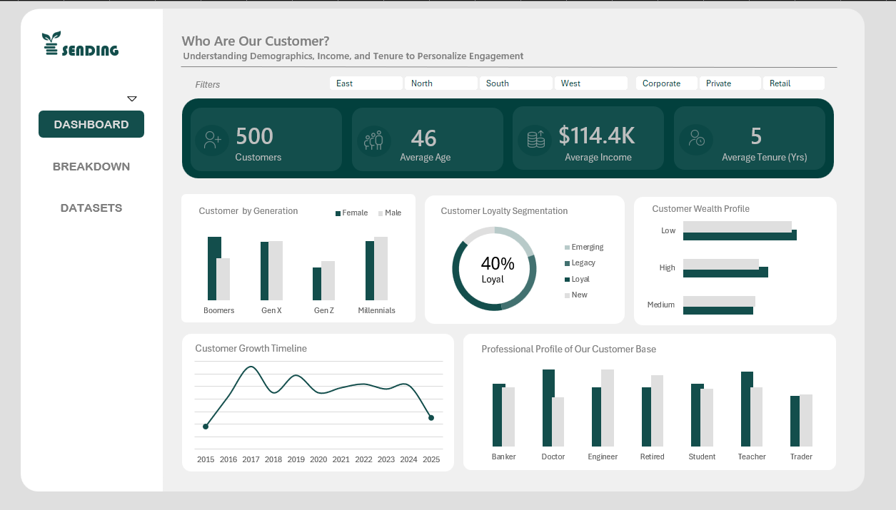

# 👥 Customer Segmentation Analysis | Microsoft Excel  

This project presents a complete **Customer Segmentation Dashboard** built using **Microsoft Excel**, designed to analyze customer demographics, income distribution, loyalty segmentation, and professional profiles. It transforms raw customer data into an **interactive, visually appealing, and insight-driven dashboard** to help businesses better understand their customer base and improve marketing strategies.  

---

## 📊 Project Overview  

The goal of this project is to transform a raw customer dataset into a **dynamic Excel dashboard** that provides key insights into customer behavior, loyalty, and demographics.  
This helps decision-makers design **personalized campaigns, improve retention**, and **analyze customer patterns** across multiple dimensions.  

---

## 🧠 Business Objectives  

- Analyze **customer distribution** by age, income, profession, and generation  
- Identify **loyal and high-value customers** using segmentation metrics  
- Track **average income and tenure** trends across loyalty groups  
- Classify customers into **wealth and loyalty segments**  
- Provide an **interactive Excel dashboard** for instant business insights  

---

## 🗂️ Data Model  

| Type | File Name | Description |
|------|------------|-------------|
| **Fact** | `customer_data.xlsx` | Contains customer demographics, income, loyalty score, and profession |
| **Dashboard** | `Customer_Segmentation_Dashboard.xlsx` | Contains interactive charts, KPIs, and segmentation filters |

📦 **Note:**  
The dataset was cleaned and structured using **Excel formulas and Power Query**.  
Then, **Pivot Tables** and **Charts** were created to design the final **interactive dashboard**.  

---

## ⚙️ Tools & Techniques Used  

| Tool / Feature | Purpose |
|----------------|----------|
| **Microsoft Excel** | Dashboard creation and visualization |
| **Power Query** | Data cleaning and transformation |
| **Pivot Tables** | Aggregation and analysis of customer data |
| **Pivot Charts** | Visual storytelling (bar, donut, and area charts) |
| **Conditional Formatting** | Highlighting income and loyalty segments |
| **Slicers** | Filter dashboard dynamically by age group, city, or profession |

---

## 💡 Key Insights  

- 👥 **Total Customers:** 500  
- 🧓 **Average Age:** 46 years  
- 💰 **Average Income:** \$114.4K  
- 📅 **Average Tenure:** 5 years  
- ❤️ **Loyal Customers:** 40% of total customers  
- 💼 **Top Professions:** Engineers, Teachers, Doctors  
- 🧭 **Dominant Generations:** Millennials & Gen X  

---

## 🔷 Excel Dashboard Preview  

### **📍 Dashboard Overview Page**  
📊 Displays all key KPIs — Total Customers, Average Age, Income, Tenure, and Loyalty %.  
📈 Includes visuals for loyalty segmentation, generation distribution, income range, and profession mix.  

  

---

## 📈 Insights Gained  

- Identified **high-value and loyal customer groups**  
- Segmented customers based on **generation, loyalty, and income**  
- Discovered **income and profession trends** for targeted marketing  
- Improved **customer understanding** using clean visual storytelling  
- Enabled **interactive exploration** through Excel slicers and charts  

---

## 📬 Contact  

**👤 Santhosh Babu S**  
🎯 *Data Analyst | Excel | Power BI | SQL | Python*  

📧 **Email:** [santhoshbabus.analyst@gmail.com](mailto:santhoshbabus.analyst@gmail.com)  
🔗 [**LinkedIn**](https://www.linkedin.com/in/santhoshbabus/) | [**GitHub**](https://github.com/santhoshbabu-analyst)  

---

⭐ *If you found this project helpful, don’t forget to star this repository!* ⭐
